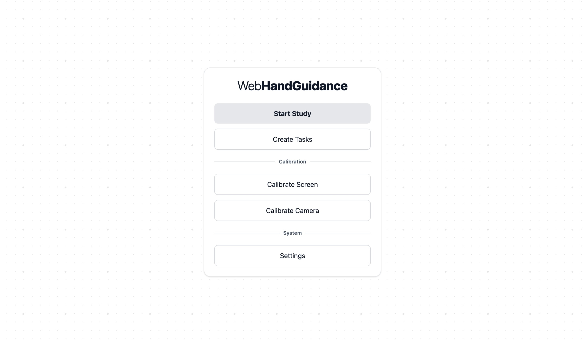
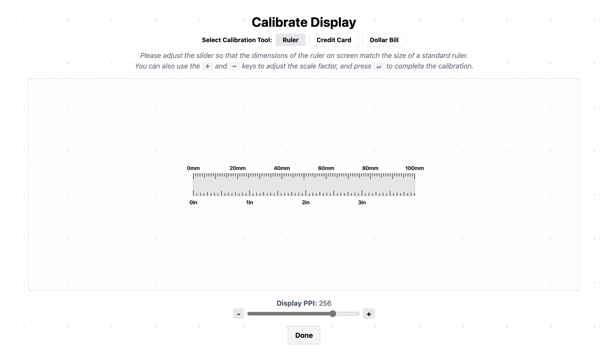
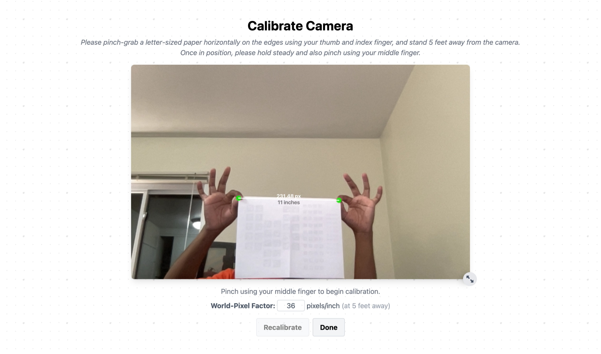
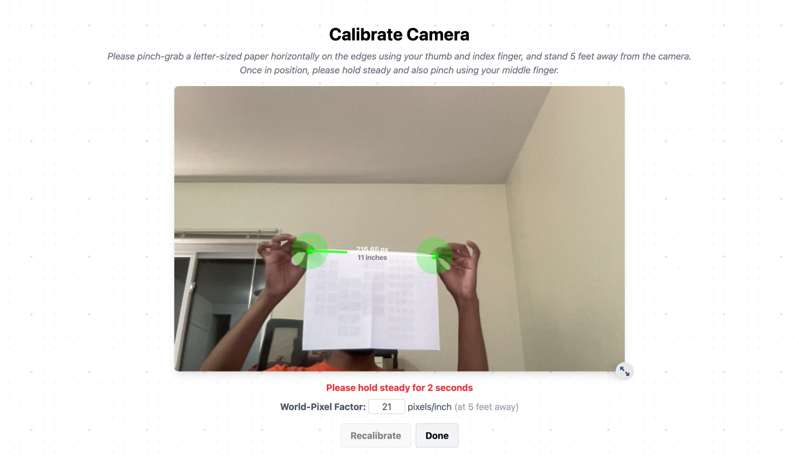
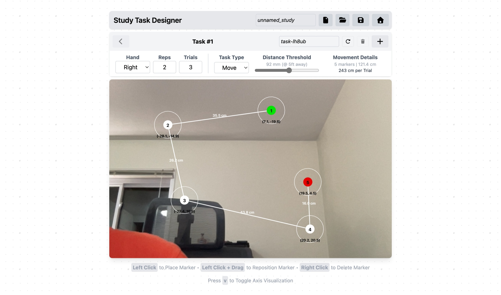
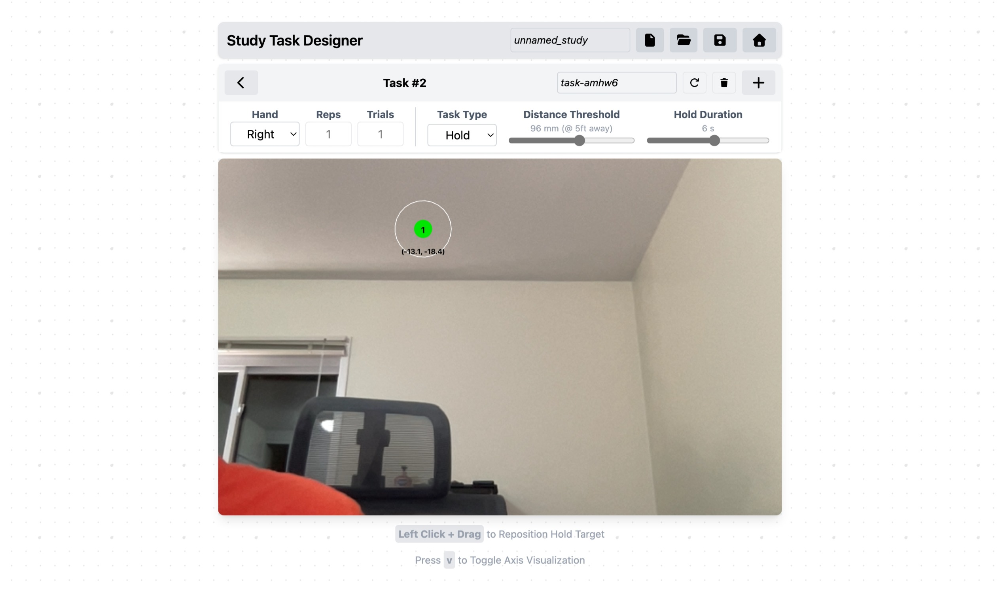
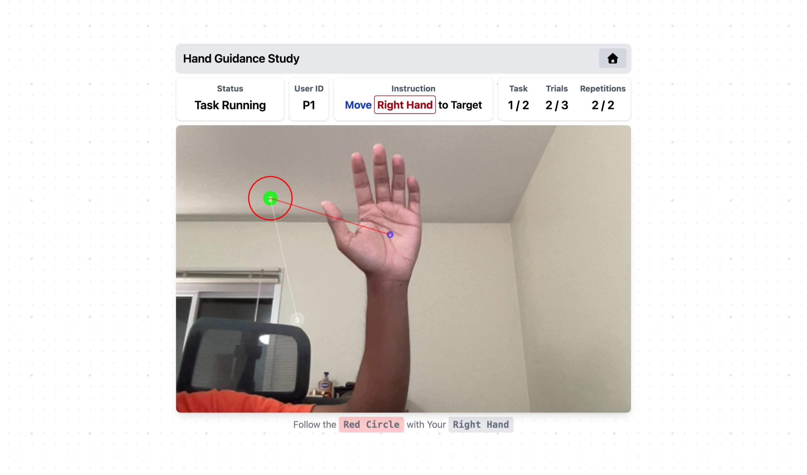
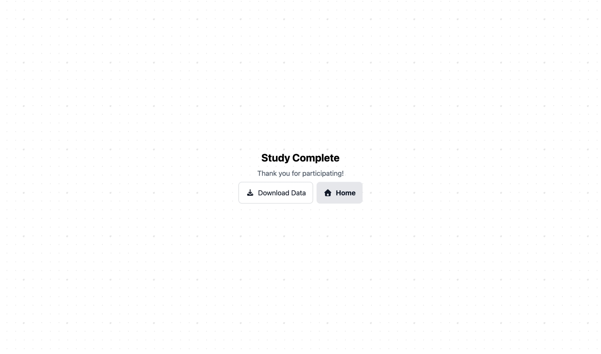

# WebHandGuidance

**WebHandGuidance** is a web‑based testbed for designing and running camera‑tracked hand navigation studies consisting of move and hold tasks. It lets designers share study links directly with participants and automatically generates downloadable tracking data from completed tasks.

## Running the System

The simplest way to run WebHandGuidance is to go to:  
👉 [adildsw.github.io/WebHandGuidance](https://adildsw.github.io/WebHandGuidance)

Alternatively, if you want to build from source:

**Prerequisites:** Node.js and npm must be installed.

1. Clone this repository:
   ```bash
   git clone https://github.com/adildsw/WebHandGuidance.git
   cd WebHandGuidance
   ```
2. Install dependencies:
   ```bash
   npm install
   ```
3. Run the development server:
   ```bash
   npm run dev
   ```
   By default, Vite will launch at [http://localhost:5173](http://localhost:5173).

If the build and launch succeed, you should see the following homepage:




## System Overview & Instructions

### 1) System Calibration

Before designing or running a study, the system must establish the correct screen-pixel and world-distance–pixel ratios to ensure accurate calculations and visualizations. This can be achieved through a two-step calibration process that needs to be done once.

#### Screen Calibration
Screen calibration aligns the on-screen scale with the physical display to ensure that pixel measurements correspond accurately to physical dimensions, and the visualizations are consistent across all devices.

- To calibrate, select **Calibrate Screen** on the main menu

- Use the on‑screen slider (or `+`/`-` hotkeys) to scale the ruler or credit card/dollar bill outline until it matches the physical object size. This yields a screen PPI value for consistent pixel‑to‑size scaling.



#### Camera Calibration
Camera calibration establishes how pixel distances map to real-world distances from a fixed viewing position, so that hand movements can be measured in physical units.

- To calibrate, select **Calibrate Camera** on the main menu

- Stand ~5 feet away from the camera (or the fixed study distance). Pinch a letter‑sized paper horizontally using thumb and index finger while keeping the middle finger away. 



- Then pinch with the middle finger as well to start calibration. Hold steady until the progress bar completes (~3 seconds). Once finished, parameters are saved for subsequent sessions.



### 2) Designing Study Tasks

The testbed supports two hand guidance task types: **Move Task** and **Hold Task**.

#### Move Task
The move task is used to measure how well the user can guide their hand through a sequence of predefined waypoints.

Click on the camera view to add markers. Drag markers to reposition them, or right-click to remove. Adjust the distance threshold to specify how close the hand must get for success, and set the number of repetitions and trials for the task.



#### Hold Task
The hold task is used to measure how steadily the user can maintain their hand at a specific target position for a set duration.

The marker can be dragged to specify the hold position. The **distance threshold** and **hold duration** can be adjusted as needed to configure the hold params.



For each task, handedness can be specified. Multiple tasks can be added within a single study design. When ready, save the study from the top bar as a **JSON** file (it can be reloaded later for edits).

### 3) Performing Tasks

There are two ways to start a study:

1. Load a Study JSON – The generated JSON file can be sent to the participants, who can load it from after clicking on **Start Study**.

2. Use the Embedded URL – Alternatively, the designer can load the JSON file on their end. Once a study JSON is loaded, it automatically embeds itself into the page URL. This URL can then be shared directly with participants so they can run the study without any additional setup.

Once the task is loaded, they appear sequentially, and the data recording starts once each task trial is initiated.



Upon completion, the results can be downloaded as a **results package** containing recorded hand positions, target positions, and task metadata.



## Contribution
We welcome contributions to this project! If you have suggestions for improvements or new features, please submit an issue or pull request.

## License
This project is licensed under the GNU General Public License v3.0.
